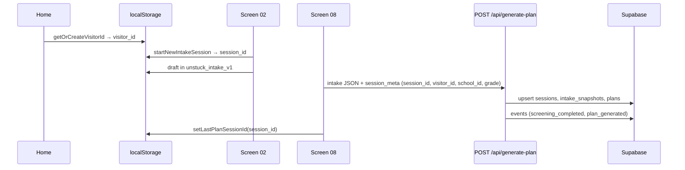
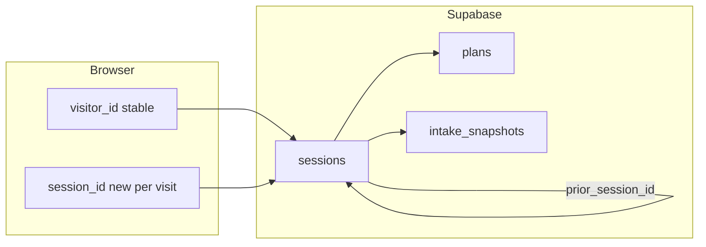

# Unstuck — Data atlas (identity, links, triggers)

**Purpose:** Quick reference when IDs get confusing — what each identifier means, where it lives, how tables link, and what code writes what.  
**Schema detail (columns, privacy, decisions):** [`DATA_MODEL.md`](DATA_MODEL.md)  
**Build phases:** [`../PROTOTYPE_BUILD.md`](../PROTOTYPE_BUILD.md)  
**Last updated:** May 2026

**How to use this doc:** Start with [ID cheat sheet](#id-cheat-sheet). For column definitions and counselor privacy rules, use `DATA_MODEL.md`. For debugging “why is this row empty?”, use [Write trigger matrix](#write-trigger-matrix).

---

## ID cheat sheet

| Name | Same as | Stored where | Lifetime | What it means |
|------|---------|--------------|----------|---------------|
| **`visitor_id`** | — | Browser `localStorage` + optional `sessions.visitor_id` | Same device/browser until cleared | “Same anonymous student over multiple visits” (D16) |
| **`session_id`** | `sessions.id` | Browser `localStorage` (current episode) + every child table FK | **One engagement episode** — new intake, return dashboard visit, or check-in visit | Join key for plans, events, intake, check_ins |
| **`prior_session_id`** | FK → `sessions.id` | Browser `localStorage` during update flow + `sessions.prior_session_id` | One return-update flow | “This episode is updating the plan from that earlier session” |
| **`school_id`** | `schools.id` | Intake draft + `sessions.school_id` | Per session row | Institutional analytics (pilot school), **not** student identity |
| **`pilot_code`** | `schools.pilot_code` | Intake draft only (UI) | Per intake form | Student-facing code (`PILOT-A`, `DEMO`) → lookup → `school_id` |
| **`plan.id`** | `plans.id` | DB only | One row per successful generate | Internal version row; app loads by `session_id` or `visitor_id`, not by `plan.id` |
| **`grade_level`** | — | Intake draft + `sessions.grade_level` | Per session row | 9–12; segmentation for counselor aggregates |

**Rule of thumb:** `visitor_id` = who (on this browser). `session_id` = which visit/episode. Never reuse an old `session_id` for a return visit — create a new one and load prior content via `visitor_id`.

---

## localStorage map

| Key | Code constant | Holds | Set when | Read when |
|-----|---------------|-------|----------|-----------|
| `unstuck_visitor_id` | `VISITOR_ID_KEY` | `visitor_id` | First Home visit (`getOrCreateVisitorId`) | Load plan, persist plan, return flows |
| `unstuck_intake_session_id` | `INTAKE_SESSION_KEY` | Current `session_id` | Screen 02 (`startNewIntakeSession`) or dashboard (`startReturnSession`) | Events, generate-plan, draft `session_id` |
| `unstuck_intake_v1` | `INTAKE_STORAGE_KEY` | Full intake draft JSON | Each intake screen save | Multi-step intake UI only (not in Supabase until plan) |
| `unstuck_intake_visit_complete` | `INTAKE_VISIT_COMPLETE_KEY` | `"1"` if plan finished | After successful plan (screen 08) | Screen 02 reset logic |
| `unstuck_last_plan_session_id` | `LAST_PLAN_SESSION_KEY` | Last saved plan’s `session_id` | After successful persist (screen 08) | Home “see saved plan” fallback; legacy return path |
| `unstuck_prior_session_id` | `PRIOR_SESSION_KEY` | Prior plan `session_id` | Dashboard return entry or update flow | Pre-fill situation (05); sent as `prior_session_id` on regenerate |

**Source:** `src/lib/sessionId.ts`, `src/intake/types.ts` (`INTAKE_STORAGE_KEY`).

---

## Student journeys (when IDs are created)

### New student — first plan

### Return student — load plan (current + target)

**Current (Phase 3 step 1):** `/intake/return` loads latest completed plan via `POST /api/load-plan` with `visitor_id` (fallback: `last_plan_session_id`).

**Production (May 2026):** Open `/` with saved plan → redirect to dashboard (04). Dashboard **Home** link uses `allowHome` to show landing without redirect. Dashboard entry → `startReturnSession(priorPlanSessionId)` → new `session_id` → load plan/intake by `visitor_id`.

### Plan update (“something changed”)

1. Return user on dashboard (04) already has new `session_id` + `prior_session_id` = session that owned the loaded plan.
2. Situation (05) pre-filled from prior `intake_snapshots.payload`.
3. Screen 08 generate → new rows for **current** `session_id`, with `visitor_id` + `prior_session_id` on `sessions`.

---

## Table links (atlas view)

Full column lists: [`DATA_MODEL.md` → Tables](DATA_MODEL.md#tables-v1-minimal).

| From | To | Join | Cardinality |
|------|-----|------|-------------|
| `sessions` | `schools` | `sessions.school_id` → `schools.id` | many : 1 |
| `sessions` | `sessions` | `sessions.prior_session_id` → `sessions.id` | optional self-FK |
| `intake_snapshots` | `sessions` | `session_id` → `sessions.id` | 1 : 1 per episode |
| `plans` | `sessions` | `session_id` → `sessions.id` | many : 1 (multiple generates rare) |
| `events` | `sessions` | `session_id` → `sessions.id` | many : 1 |
| `check_ins` | `sessions` | `session_id` → `sessions.id` | many : 1 (Phase 3 Session B) |

**Load prior plan for return:** query `sessions` where `visitor_id = ?` and `completed_plan = true`, order by `created_at desc`, limit 1 → join `plans` + `intake_snapshots` on that `session_id`.

---

## Write trigger matrix

| Trigger | Route / module | Reads | Writes |
|---------|----------------|-------|--------|
| Home load | `Home.tsx` | `last_plan_session_id` | `visitor_id`; redirect to `/dashboard` if plan saved and not `allowHome` / `?stay=1` |
| Screen 02 submit | client | pilot code → `school_id` | `localStorage`: new `session_id`, draft; event via log-event |
| Intake navigation | `useScreenViewed` / client | draft | `POST /api/log-event` → may upsert minimal `sessions` + `events` |
| Generate plan | `POST /api/generate-plan` | intake JSON, `session_meta` | `sessions` (full row), `intake_snapshots`, `plans`, `events` |
| Load plan (return) | `POST /api/load-plan` | `visitor_id` or `session_id` | **Read only** |
| Check-in submit | `POST /api/submit-check-in` | `session_id`, `plan_session_id`, `responses[]`, `session_meta` | `check_ins`, `events` (`check_in_submitted`) |
| Counselor aggregates | `POST /api/counselor-aggregates` | `school_id`, `grade_level`, `timeline_start`, `timeline_end`, `day_of_week_filter` | **Read only** |
| Resource click | client → `POST /api/log-event` | allowlisted URL | `events` |
| Demo seed | `npm run seed:demo` | fixture profiles | `sessions`, `intake_snapshots`, `plans`, `events` (`is_demo = true`) |

### `sessions` row lifecycle

| Stage | `completed_plan` | Typical trigger |
|-------|------------------|-----------------|
| Stub row | `false` | First event with `session_meta` (`ensureSession` in `lib/events.mjs`) |
| Plan saved | `true` | `persistPlanSession` after successful Claude plan (`lib/persistSession.mjs`) |

Early events can create a **minimal** session row (grade, school, no plan). Generate-plan **upserts** the same `session_id` with `completed_plan = true`, intake, and plan rows.

### `session_meta` payload (API)

Sent on generate-plan and log-event from the client:

| Field | Required | Maps to |
|-------|----------|---------|
| `session_id` | Yes (persist) | `sessions.id` |
| `school_id` | Yes | `sessions.school_id` |
| `grade_level` | Yes | `sessions.grade_level` |
| `visitor_id` | Phase 3+ | `sessions.visitor_id` |
| `prior_session_id` | Update flows | `sessions.prior_session_id` |
| `is_demo` | Optional | `sessions.is_demo` (`DEMO` pilot code) |
| `flagged_account` | Optional | `sessions.flagged_account` |

---

## Read patterns (who queries what)

| Actor | Query by | Gets |
|-------|----------|------|
| Student — return | `visitor_id` (preferred) or `session_id` | Latest `plan_json` + intake payload |
| Student — intake UI | `localStorage` draft | In-progress fields only |
| Counselor dashboard (Phase 4) | `school_id` aggregates | Counts/rates — **no** row-level student view |
| Builder / Supabase SQL | Any | Full rows for pilot debugging |

---

## Migrations index

| File | Adds |
|------|------|
| `001_initial.sql` | `schools`, `sessions`, `intake_snapshots`, `plans` |
| `002_grants.sql` | Service role grants |
| `003_events.sql` | `events` |
| `004_events_grants.sql` | Events grants |
| `005_visitor_id.sql` | `sessions.visitor_id`, `sessions.prior_session_id` |
| `006_check_ins.sql` | `check_ins` (per-task responses) |
| `007_check_ins_grants.sql` | `check_ins` service role grants |

Apply new migrations in Supabase SQL Editor before relying on new columns in production.

---

## Counselor KPI definitions (Phase 4)

Logic: `lib/counselorKpiPeriod.mjs` + `lib/counselorAggregates.mjs`. UI: `/counselor/dashboard` (screen 15).

**Inclusion rule:** Only rows with a valid **`visitor_id`**. Legacy sessions without it are excluded from all counselor KPIs (count shown in `excluded_sessions_no_visitor_id`).

**Filters (all drive KPIs, categories, resources, and pattern text):**

| Filter | API field | Behavior |
|--------|-----------|----------|
| Grade | `grade_level` (`all` or 9–12) | Subset sessions before date/day filters |
| Date range | `timeline_start`, `timeline_end` (YYYY-MM-DD, inclusive UTC) | Default: rolling last 30 days if omitted |
| Day of week | `day_of_week_filter` (`all` or weekday name) | Subset by `sessions.created_at` weekday (UTC) |

**Date picker UX:** Changing the visible date does not refresh aggregates until the user picks a day from the calendar or leaves the field (blur). Arrow keys on the field update the display only until commit.

| KPI | Definition |
|-----|------------|
| **Students with a plan** | Unique `visitor_id` with ≥1 `completed_plan` session in the date range |
| **New plan sessions** | First completed plan per visitor in the date range |
| **Return plan sessions** | Later completed plan in range (`prior_session_id` or not the visitor's first plan) |
| **Resource engagement %** | Plan sessions in range with ≥1 `resource_link_clicked` ÷ plan sessions with `plan_generated` |
| **Contact requests** | `check_ins` in range where `task_id = counselor_contact` and `response = contact_counselor` |

**Categories:** Per situation tag, `session_count` and `percent` of plan sessions in range (multi-select; percents can sum above 100%).

**Patterns & Actionable Insights:** Rule-based blurb from top categories/resources (`buildPatternObservation`); no counselor LLM API.

**Small-n:** Suppress detail if fewer than 5 students with a plan in range (`SMALL_N_FLOOR`, D9). Capstone demo school (`00000000-0000-4000-8000-000000000002`) is never suppressed.

**Demo seed:** `npm run seed:demo` — May 2026 session dates; run if dashboard is empty or missing `visitor_id` on demo rows.

---

## Phase 4+ documentation options (deferred)

Return to these **after Phase 4 / capstone wrap** if time allows — not required for MVP.

| Option | Benefit | Effort |
|--------|---------|--------|
| **`COMMENT ON COLUMN` in SQL migrations** | Field descriptions visible in Supabase Table Editor | Low — add to next migration or a `006_comments.sql` |
| **One-page PDF export of this atlas** | Portfolio / faculty appendix | Low — export from markdown |
| **Auto-generated schema docs** (e.g. Supabase CLI, dbdocs) | Stays in sync with DDL | Medium — setup + CI; still needs atlas for localStorage/triggers |
| **Spreadsheet data dictionary** | Familiar to some reviewers | High drift risk — **not recommended** as a second source of truth |

**Decision:** Capstone uses **`DATA_MODEL.md` + this atlas** as the canonical docs. Revisit the table above at end-of-build; implement only what still adds value.

---

## Changelog

| Date | Change |
|------|--------|
| May 2026 | Initial atlas: ID cheat sheet, localStorage map, journeys, triggers, Phase 4+ deferrals |
